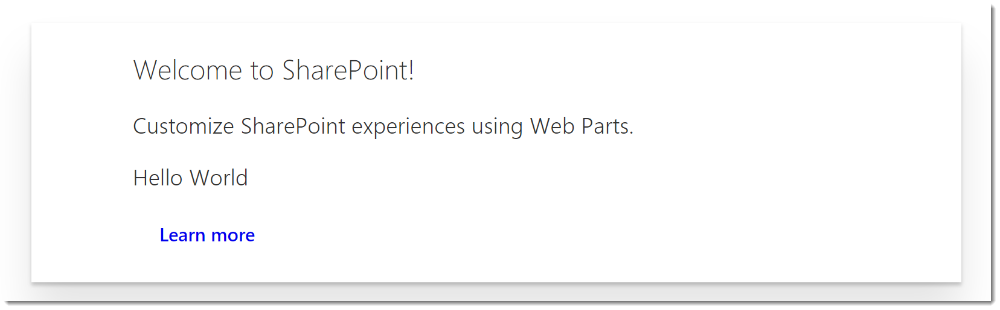
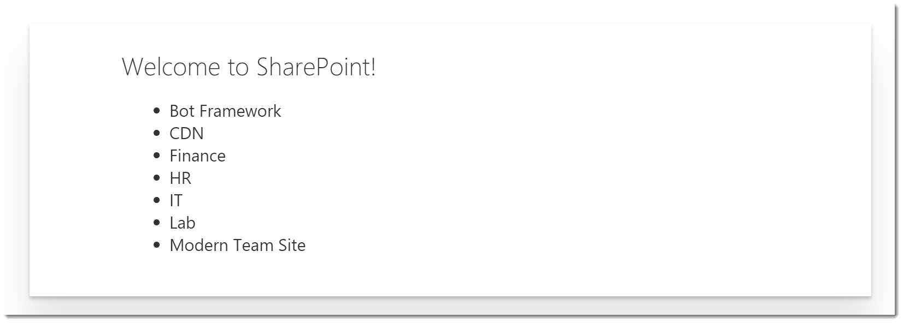

# Prototype for Angular Elements web part

## Summary
This is an experimental prototype for using Angular Elements in the context of SharePoint Framework web part.

> Stay tuned for more updates. In meanwhile, feel free to provide feedback using the Issue list in this repository. We are highly interested on your feedback. 

### Hello World Demo


### Graph Demo


## Used SharePoint Framework Version 


## Applies to

* [SharePoint Framework General Availability](http://dev.office.com/sharepoint/docs/spfx/sharepoint-framework-overview)
* [Office 365 developer tenant](http://dev.office.com/sharepoint/docs/spfx/set-up-your-developer-tenant)

## Building the code

```bash
git clone the repo
npm i
npm i -g gulp
gulp serve
```

## Solution

Solution|Author(s)
--------|---------
sp-dev-fx-angular|Rob Wormald (Google, @robwormald), Sébastien Levert (MVP, Valo Intranet, @sebastienlevert)

## Version history

Version|Date|Comments
-------|----|--------
1.0|November 16, 2017|Initial release
1.1|December 01, 2017|Update documentation and code cleaning

## Disclaimer
**THIS CODE IS PROVIDED *AS IS* WITHOUT WARRANTY OF ANY KIND, EITHER EXPRESS OR IMPLIED, INCLUDING ANY IMPLIED WARRANTIES OF FITNESS FOR A PARTICULAR PURPOSE, MERCHANTABILITY, OR NON-INFRINGEMENT.**

# Contributing

This project welcomes contributions and suggestions.  Most contributions require you to agree to a
Contributor License Agreement (CLA) declaring that you have the right to, and actually do, grant us
the rights to use your contribution. For details, visit https://cla.microsoft.com.

When you submit a pull request, a CLA-bot will automatically determine whether you need to provide
a CLA and decorate the PR appropriately (e.g., label, comment). Simply follow the instructions
provided by the bot. You will only need to do this once across all repos using our CLA.

This project has adopted the [Microsoft Open Source Code of Conduct](https://opensource.microsoft.com/codeofconduct/).
For more information see the [Code of Conduct FAQ](https://opensource.microsoft.com/codeofconduct/faq/) or
contact [opencode@microsoft.com](mailto:opencode@microsoft.com) with any additional questions or comments.

 
